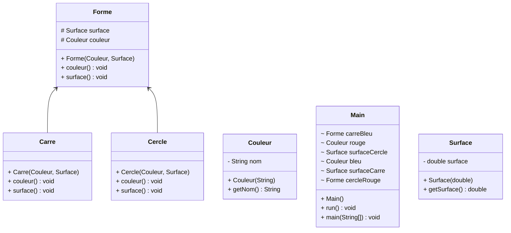

```mermaid 
classDiagram
direction BT
class Carre {
  + Carre(Couleur, Surface) 
  + couleur() void
  + surface() void
}
class Cercle {
  + Cercle(Couleur, Surface) 
  + couleur() void
  + surface() void
}
class Couleur {
  + Couleur(String) 
  - String nom
  + getNom() String
}
class Forme {
  + Forme(Couleur, Surface) 
  # Surface surface
  # Couleur couleur
  + couleur() void
  + surface() void
}
class Main {
  + Main() 
  ~ Forme carreBleu
  ~ Couleur rouge
  ~ Surface surfaceCercle
  ~ Couleur bleu
  ~ Surface surfaceCarre
  ~ Forme cercleRouge
  + run() void
  + main(String[]) void
}
class Surface {
  + Surface(double) 
  - double surface
  + getSurface() double
}

Carre  -->  Forme 
Cercle  -->  Forme 

```