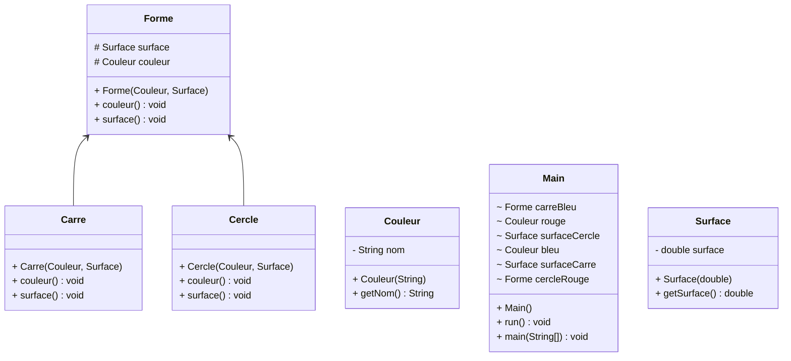

Le patron de conception "Pont" (ou "Bridge" en anglais) est un modèle de conception structurelle qui vise à séparer l'abstraction d'une implémentation,
permettant ainsi à chaque partie d'évoluer indépendamment. Ce patron est particulièrement utile lorsqu'une classe abstraite peut avoir plusieurs variantes d'implémentations,
et il est crucial de maintenir la flexibilité des deux aspects (abstraction et implémentation) indépendamment l'un de l'autre.

Le design pattern Pont(Bridge) existe pour résoudre les problèmes suivants :
1- Couplage fort entre abstraction et implémentation : Dans les systèmes où une abstraction peut avoir plusieurs implémentations,
le couplage fort entre ces deux aspects peut rendre le système difficile à maintenir et à étendre. Le pattern Pont permet de séparer l'abstraction de l'implémentation,
facilitant les modifications et les extensions des deux côtés indépendamment.

2- Complexité croissante : Lorsque de nouvelles fonctionnalités sont ajoutées (par exemple, de nouvelles formes ou de nouvelles couleurs),
le code peut devenir très complexe si l'abstraction et l'implémentation sont combinées. Le pattern Pont aide à maintenir une structure claire et
à éviter l'explosion combinatoire des classes.

3- Flexibilité : Il permet de modifier ou d'étendre l'abstraction sans affecter les implémentations concrètes.
Cela facilite l'évolution du système sans nécessiter des changements importants dans le code existant.

Avantages:
1- Indépendance : Vous pouvez ajouter de nouvelles formes ou de nouvelles méthodes de dessin sans modifier le code existant.
2- Flexibilité : Les formes peuvent utiliser différentes méthodes de dessin sans dépendre des détails d'implémentation.

Utilisation:
-Exemple utiliser dans le code: 
1-
    //Créaton des objets couleur
    Couleur rouge = new Couleur("Rouge");
    Couleur bleu = new Couleur("Bleu");
2-
    //Créaton des objets surface
    Surface surfaceCercle = new Surface(30);
    Surface surfaceCarre = new Surface(50);
3-
    //Créaton des objets forme qui appelle les objets couleur et surface
    Forme cercleRouge = new Cercle(rouge,surfaceCercle);
    Forme carreBleu = new Carre(bleu,surfaceCarre);

Affichage des objets:
   // Affiche "Bleu" comme couleur
   carreBleu.couleur();
   // Affiche "25.0" comme surface
   carreBleu.surface(); 

   // Affiche "Rouge" comme couleur
   cercleRouge.couleur();
   // Affiche "50.0" comme surface
   cercleRouge.surface(); 

Dans cet exemple j'utilise les classes suivante les méthodes :

